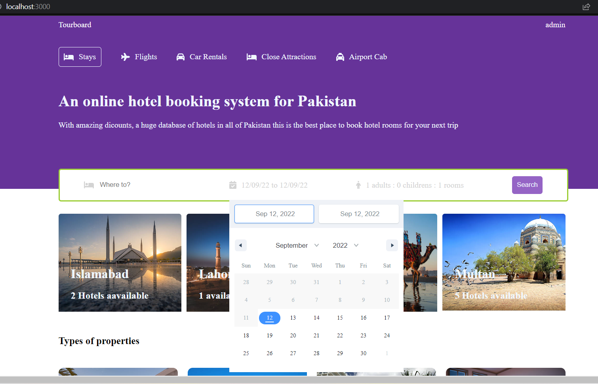
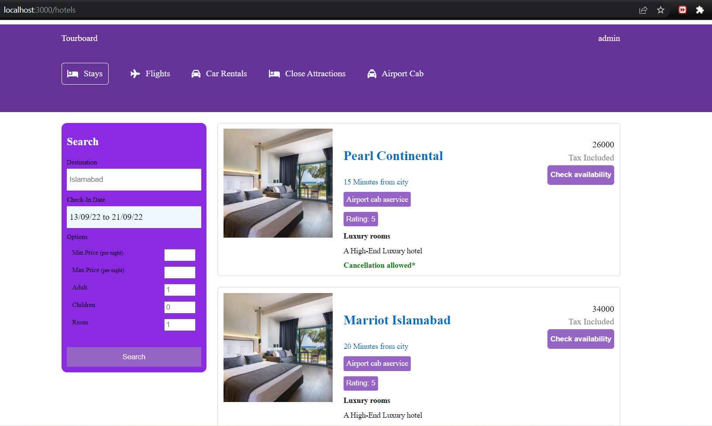

# HotelBoard

This is my projet, where I'm developing a Hotel Booking System app using MERN Stack.
My database I'm using mongo cloud database where I'm storing my data for user hotel and rooms.

Images:

Implemented Features:

-Login/SignUp, with all the backend authentication modules, including custom error middlewares.

-JWT and Cookies used for User Authentication.

-BCRYPT for password storage

-Custom Fetch Hooks for getting data from backend

-Search functionality

Future Plans:

-Admin Panel.

-Confirmation emails.

-Reciept generation.

-More features.
